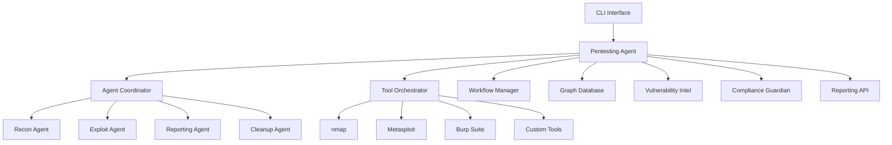

# Aider Pentesting Agent

A next-generation, autonomous pentesting agent built on top of Aider. This framework provides comprehensive security assessment capabilities with LLM flexibility, multi-agent coordination, and enterprise-grade compliance features.

## 🚀 Quick Start

### 5-Minute Setup with Docker

```bash
# Clone and setup
git clone https://github.com/Aider-AI/aider.git
cd aider
chmod +x setup_demo.sh
./setup_demo.sh

# Run demo campaign
docker exec -it aider-pentesting-agent python -m aider --pentest-demo
```

### Manual Installation

```bash
# Install Aider with pentesting extensions
pip install aider-chat[pentest]

# Run pentesting mode
aider --pentest --pentest-target http://localhost:3000 --pentest-type web
```

## 🎯 Features

### 1. LLM Flexibility
- **Multiple Providers**: OpenAI, Claude, Gemini, Hugging Face, Local Llama
- **MCP-Compliant Configuration**: Single config file for all providers
- **Dynamic Switching**: Change models without code modifications

```json
{
  "llm_providers": [
    {"name": "openai", "model": "gpt-4", "enabled": true},
    {"name": "claude", "model": "claude-3-sonnet", "enabled": true},
    {"name": "local", "base_url": "http://localhost:11434", "model": "llama2"}
  ]
}
```

### 2. Tool Orchestration
- **Auto-Installation**: One-command setup for all security tools
- **Sandboxed Execution**: Isolated tool execution for safety
- **Core Tools**: nmap, Metasploit, Burp Suite, Wireshark, sqlmap, nikto, gobuster
- **Plugin Architecture**: 10-minute registration for new tools

```bash
# Auto-install security tools
aider --pentest --pentest-auto-install

# Register custom tool
aider --pentest --register-tool '{"name": "custom_scanner", "install_cmd": "apt install custom-scanner"}'
```

### 3. Multi-Agent Workflow Engine
- **Specialized Agents**: Recon, Exploit, Reporting, Cleanup
- **Message Bus Coordination**: Real-time agent communication
- **Reinforcement Learning**: Self-optimizing workflows (optional)

### 4. Domain Workflows
Pre-built templates for different security testing domains:

- **Web Application**: OWASP Top 10, API testing, authentication bypass
- **Network**: Port scanning, service enumeration, lateral movement
- **Social Engineering**: Phishing campaigns, OSINT gathering
- **Reverse Engineering**: Binary analysis, malware research
- **Fuzzing**: Input validation, crash analysis
- **Post-Exploitation**: Persistence, privilege escalation, data exfiltration

```bash
# Use specific workflow
aider --pentest --pentest-target 192.168.1.100 --pentest-type network
aider --pentest --pentest-target app.company.com --pentest-workflow web_advanced
```

### 5. Target & Credential Graph
- **Graph Database**: Neo4j-style relationships for security data
- **Path Finding**: Lateral movement route discovery
- **Risk Propagation**: Real-time risk calculation across network

### 6. Vulnerability Intelligence
- **CVE/CVSS Integration**: Automated feed synchronization
- **Exploit Mapping**: Link findings to known exploits
- **Composite Scoring**: Advanced risk calculation

**Risk Formula**: `R = α × CVSS + β × Exploitability`

### 7. Safety & Compliance
- **Zero-Trust Architecture**: Mandatory consent and validation
- **Immutable Audit Logs**: Tamper-proof activity tracking
- **Compliance Frameworks**: SOC 2, ISO 27001 mapping
- **Ethical Boundaries**: Automated scope enforcement

### 8. Reporting API
- **Multiple Formats**: PDF, HTML, Markdown, JSON
- **REST Endpoint**: `/api/reports` for CI/CD integration
- **Real-time Status**: Live assessment monitoring

```bash
# Generate reports
curl http://localhost:8080/api/reports

# CI/CD integration
curl -X POST http://localhost:8080/api/reports/generate \
  -H "Content-Type: application/json" \
  -d '{"results": {...}, "formats": ["json", "html"]}'
```

### 9. Resource Awareness
- **GPU/CPU Detection**: Automatic resource optimization
- **Cloud Bursting**: Fallback to cloud LLMs when needed
- **Offline Mode**: Full functionality without internet

## 📊 Demo Campaign

The demo campaign showcases autonomous pentesting capabilities:

```bash
# Run complete demo
aider --pentest-demo

# Individual targets
aider --pentest --pentest-target http://localhost:3000 --pentest-workflow juice_shop
aider --pentest --pentest-target 192.168.1.100 --pentest-workflow metasploitable  
aider --pentest --pentest-target demo.company.com --pentest-workflow phishing_sim
```

### Demo Targets
1. **OWASP Juice Shop**: Web application security testing
2. **Metasploitable 2**: Network penetration testing
3. **Phishing Simulation**: Social engineering assessment

## 🔧 Configuration

### Security Configuration

```yaml
security_config:
  enforce_zero_trust: true
  require_consent: true
  audit_log_enabled: true
  allowed_targets:
    - "192.168.0.0/16"
    - "10.0.0.0/8"
    - "localhost"
  blocked_targets:
    - "8.8.8.8"
  compliance_frameworks:
    - "SOC2"
    - "ISO27001"
```

### Tool Configuration

```yaml
tool_config:
  auto_install: true
  sandbox_mode: true
  tool_timeout: 300
  max_parallel_tools: 10
  custom_tools_path: "./custom_tools"
```

### Agent Configuration

```yaml
agent_config:
  enable_multi_agent: true
  max_agents: 5
  coordination_mode: "message_bus"
  reward_learning: false
```

## 🏗️ Architecture



## 📝 Usage Examples

### Basic Assessment

```bash
# Quick web assessment
aider --pentest --pentest-target https://example.com --pentest-type web

# Network penetration test
aider --pentest --pentest-target 192.168.1.0/24 --pentest-type network

# Full assessment with custom workflow
aider --pentest --pentest-target company.com --pentest-workflow comprehensive
```

### Advanced Configuration

```bash
# Custom configuration file
aider --pentest --pentest-config ./pentest-config.json --pentest-target app.com

# Specific report formats
aider --pentest --pentest-target app.com --pentest-report-formats json html pdf

# Custom API port
aider --pentest --pentest-api-port 9090
```

### Interactive Mode

```bash
# Start interactive pentesting session
aider --pentest

# In interactive mode:
> /target https://example.com
> /workflow web_comprehensive  
> /start
> /status
> /report html
```

## 🧪 Testing

### Run Tests

```bash
# Unit tests
pytest tests/test_pentest.py -v

# Integration tests
pytest tests/test_pentest_integration.py -v

# Coverage report
pytest tests/test_pentest.py --cov=aider.pentest --cov-report=html
```

### Test Requirements
- **Unit Tests**: ≥90% line coverage
- **Integration Tests**: End-to-end workflow validation
- **Performance Tests**: 100 host parallel scan validation

## 🚨 Compliance & Ethics

### Audit Logging
All activities are logged with immutable signatures:

```json
{
  "timestamp": "2024-01-15T10:30:00Z",
  "event_type": "ASSESSMENT_STARTED",
  "event_data": {
    "target": "example.com",
    "consent_verified": true,
    "operator": "security_team"
  },
  "signature": "sha256:abc123..."
}
```

### Consent Verification
Mandatory consent checks before any testing:

```bash
# Consent is required for all targets
aider --pentest --pentest-target example.com
# → "Consent verification required for example.com"
# → "Please confirm authorization: [y/N]"
```

### Compliance Reports

```bash
# Generate SOC 2 compliance report
aider --pentest --compliance-report SOC2

# Generate ISO 27001 compliance report  
aider --pentest --compliance-report ISO27001
```

## 🔌 Extension Development

### Custom Tool Registration

```python
from aider.pentest.tools.orchestrator import ToolOrchestrator

# Register custom tool
tool_config = {
    "name": "custom_scanner",
    "install_cmd": "pip install custom-scanner",
    "check_cmd": "custom-scanner --version",
    "sandbox": True
}

orchestrator = ToolOrchestrator(config)
await orchestrator.register_custom_tool(tool_config)
```

### Custom Workflow Templates

```json
{
  "name": "custom_web_workflow", 
  "description": "Custom web application testing",
  "domain": "web",
  "phases": [
    {
      "name": "discovery",
      "agent": "recon", 
      "tasks": [
        {"type": "subdomain_enum", "tools": ["subfinder", "amass"]},
        {"type": "port_scan", "ports": [80, 443, 8080, 8443]}
      ]
    }
  ]
}
```

### Custom Agent Development

```python
from aider.pentest.agents.coordinator import SpecializedAgent

class CustomAgent(SpecializedAgent):
    def __init__(self, config, io):
        super().__init__("custom", config, io)
    
    async def _execute_task_impl(self, task):
        # Custom agent implementation
        return {"status": "completed", "findings": []}
```

## 📚 API Reference

### REST API Endpoints

```
GET  /api/status              # Agent status
GET  /api/reports             # List reports  
GET  /api/reports/{id}        # Get specific report
POST /api/reports/generate    # Generate new report
GET  /api/tools               # Available tools
GET  /api/workflows           # Available workflows
GET  /api/compliance          # Compliance status
```

### Python API

```python
from aider.pentest import PentestAgent, PentestConfig

# Initialize agent
config = PentestConfig.from_file("config.json")
agent = PentestAgent(config)

# Run assessment
await agent.initialize()
results = await agent.run_assessment(
    target="example.com",
    assessment_type="web",
    workflow_template="owasp_top10"
)

# Generate reports
reports = await agent.reporting_api.generate_reports(results)
```

## 🛠️ Troubleshooting

### Common Issues

1. **Tool Installation Failures**
   ```bash
   # Manual tool installation
   aider --pentest --pentest-auto-install --verbose
   ```

2. **Permission Denied**
   ```bash
   # Run with proper permissions
   sudo aider --pentest --pentest-target localhost
   ```

3. **API Connection Issues**
   ```bash
   # Check API status
   curl http://localhost:8080/api/status
   ```

### Debug Mode

```bash
# Enable verbose logging
aider --pentest --verbose --pentest-target example.com

# Debug specific component
AIDER_DEBUG=pentest.tools aider --pentest
```

## 🤝 Contributing

1. Fork the repository
2. Create feature branch: `git checkout -b feature/new-tool`
3. Add tests for new functionality
4. Ensure 90%+ test coverage
5. Submit pull request

### Development Setup

```bash
# Clone and setup development environment
git clone https://github.com/Aider-AI/aider.git
cd aider
pip install -e .[dev,pentest]

# Run tests
pytest tests/test_pentest.py
```

## 📄 License

This project is licensed under the Apache 2.0 License - see the [LICENSE](LICENSE.txt) file for details.

## 🙏 Acknowledgments

- Built on the Aider AI pair programming framework
- Inspired by modern offensive security tools
- Designed with enterprise compliance in mind
- Community-driven development approach